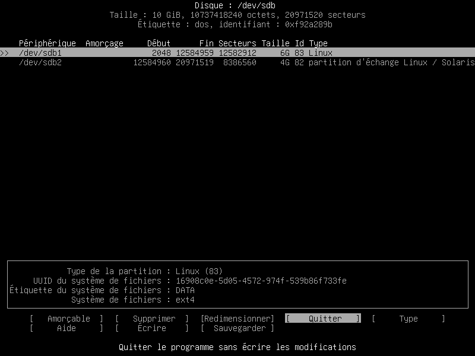
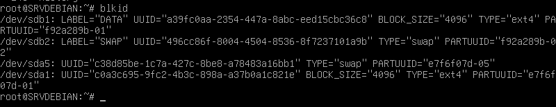

Préparation disques

cfdisk /dev/sdb 
+ Permet d'afficher le disque

Créer une nouvelle partion 
+ nouvelle / primaire / 6G
+ nouvelle / primaire / 4G
+ Ecrire la partition
+ Quitter

 

Formater les partitions
+ mkfs.ext4 -L DATA /dev/sdb1
+ mkswap -L SWAP /dev/sdb2

blkid permet permet d'avoir les UUID mais aussi de verifier les labels 

