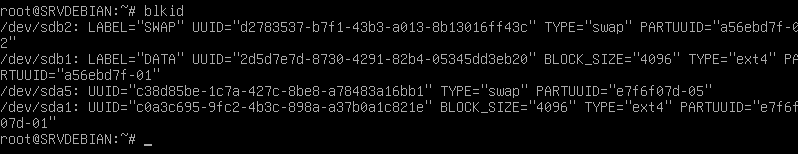
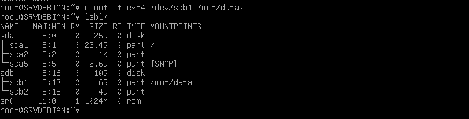

# Préparation disques

> + cfdisk /dev/sdb 
## Permet d'afficher le disque

## Deux partitions

## Sauvegarder

## Formater les partitions
> + mkfs.ext4 -L DATA /dev/sdb1
> + mkswap -L SWAP /dev/sdb2

## Activation du SWAP

## Noms des partitions

> + blkid permet permet d'avoir les UUID mais aussi de verifier les labels 

## Montage de la partition

> + mount -t ext4 /dev/sdb1 /mnt-data

# Montage Automatique au démarrage

> + nano /etc/fstab

## Redémarrage de la machine et Vérification

